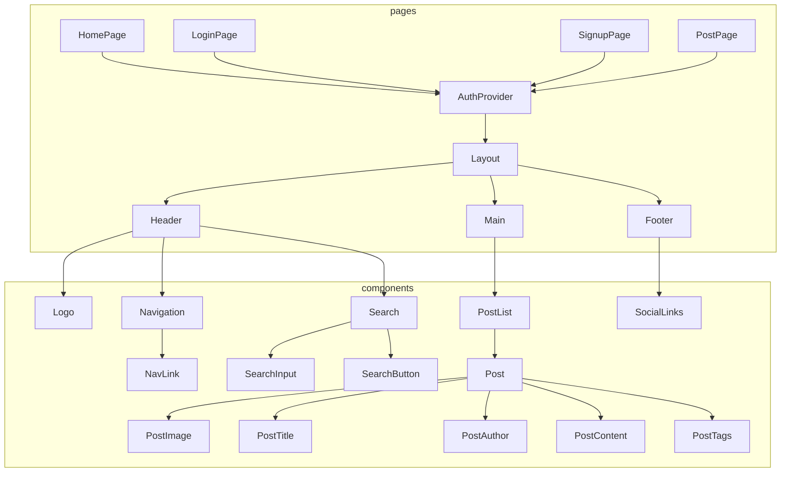
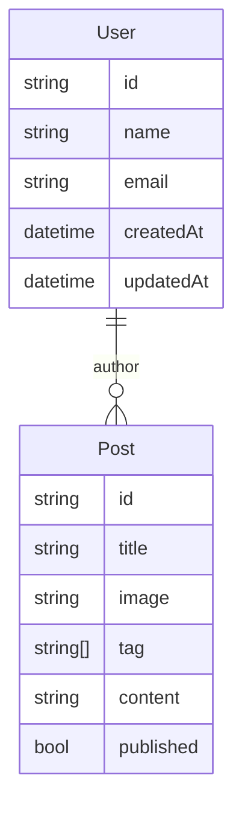

# S.Y.T.Y.C.C.Blog

- **Description:** 
"So You Think You Can Code?"
This is a blogging app built with Next.js, Prisma, and PostgreSQL. The app allows users to create an account and publish blog posts. Users can view a list of all published posts, view individual posts, search for posts based on their title or tag, delete, and upgrade a post(only if the post was created by this user).  This application is written in TypeScript, ensuring strong type safety throughout the codebase. Overall, the app is designed to provide a modern and user-friendly interface for creating and sharing content online.

## Technologies Used
  * Next.js
  * Next.js API routes
  * Prisma
  * PostgreSQL 
  * NextAuth.js 
  * TypeScript
  * Tailwind CSS
  * Figma
  * bit.io
  * Vercel

## Component Architecture

### API Route Table
| Route |	Method |	Description | 
|-------------|---------|-------------|
|/api/posts |	GET |	Retrieve a list of all published posts |
|/api/posts|	POST|	Create a new post|
|/api/posts/:id|	GET	|Retrieve a specific post based on its ID|
|/api/posts/:id|	PUT |	Update an existing post based on its ID|
|/api/posts/:id|	DELETE|	Delete an existing post based on its ID|

### ERD Model

### Desktop Wireframes

### Mobile Wireframes

* [Deployed Website](https://sytycc-blog.vercel.app/) 

#### Note: 
 More features will be added as this project progresses